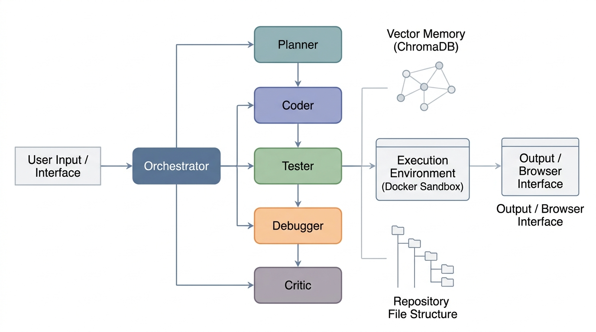
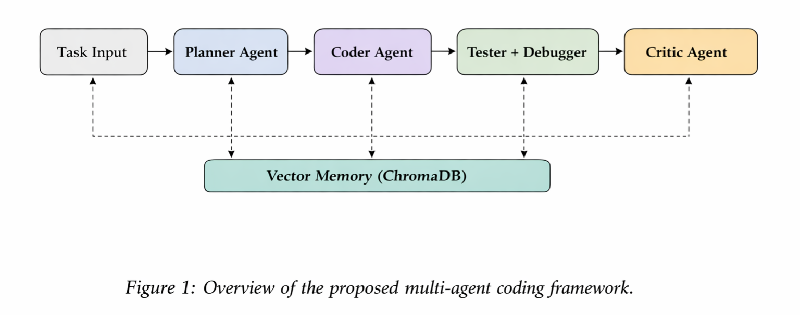
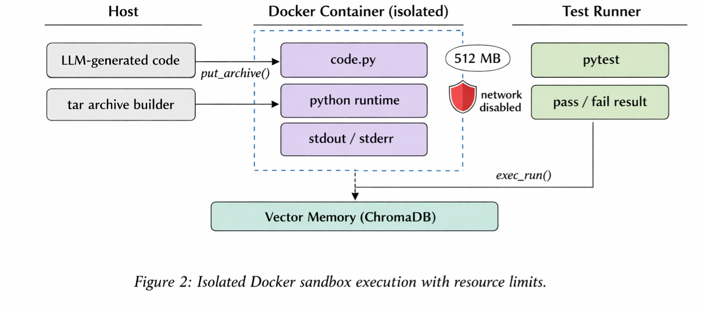
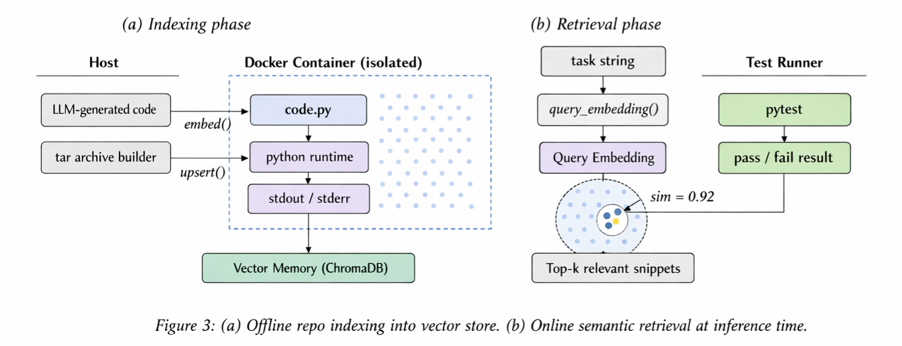

# AutoCodeAI — Multi-Agent Autonomous Coding System v2.0

> A production-grade, multi-agent AI coding framework with **parallel execution**, **tool integration**, **flexible LLM support**, sandboxed execution, semantic memory, real-time streaming, and git-native output.


*Figure 1: Overview of the multi-agent AI coding framework pipeline.*

---

## 🆕 What's New in v2.0

**Major enhancements:**

- **🔧 Tool Integration** — Execute git commands, pip installs, and shell operations directly from agent plans
- **⚡ Parallel Execution** — Run independent coding tasks concurrently for 3-5x faster completion
- **🌐 Flexible LLM Support** — Switch between LiteLLM (100+ providers), OpenAI, DeepSeek, or local models (Ollama)
- **🖥️ Web UI** — Beautiful, modern web interface for task submission and real-time output streaming
- **📊 Enhanced Planning** — Planner can now create parallel execution groups and tool execution steps

---

## Table of Contents

- [Overview](#overview)
- [Architecture](#architecture)
- [Agents](#agents)
- [Project Structure](#project-structure)
- [Installation](#installation)
- [Configuration](#configuration)
- [Usage](#usage)
- [API Reference](#api-reference)
- [How It Works](#how-it-works)
- [Running Tests](#running-tests)
- [Contributing](#contributing)
- [License](#license)

---

## Overview

AutoCodeAI is an autonomous software engineering system that breaks down a natural language task into a structured plan, executes it across a team of specialized AI agents, validates the output in an isolated Docker sandbox, and streams every token back to the client in real time.

**Key capabilities:**

- **Multi-agent orchestration** — Planner, Coder, Tester, Debugger, and Critic agents collaborate on every task
- **Parallel execution** — Independent tasks run concurrently with automatic dependency management
- **Tool integration** — Git operations, package installation, shell commands executed safely
- **Flexible LLM backends** — LiteLLM, OpenAI, DeepSeek, or local models (Ollama)
- **Sandboxed execution** — All generated code runs inside a resource-limited, network-disabled Docker container
- **Semantic memory** — Past tasks and repo context stored in ChromaDB, retrieved by vector similarity
- **Live streaming** — Token-by-token output via Server-Sent Events (SSE) and WebSocket
- **Web UI** — Modern, responsive interface for interactive task management
- **Diff-based editing** — Existing files edited via minimal unified diffs, not full rewrites
- **Repo awareness** — Watchdog monitors the repo and keeps the vector index live in real time

---

## Architecture


*Figure 2: Agent interaction sequence — from task input to validated code output.*

| Layer | Components | Description |
|---|---|---|
| API | FastAPI, SSE, WebSocket | Receives tasks, streams output to clients |
| Orchestration | `Orchestrator` | Coordinates agents, manages memory, drives the pipeline |
| Agents | Planner · Coder · Tester · Debugger · Critic | Each agent owns one responsibility |
| Memory | ChromaDB, `RepoIndexer`, `MemoryAgent` | Vector store for past results and live repo context |
| Execution | `DockerSandbox` | Isolated container with resource caps and no network |

---

## Agents


*Figure 3: Roles and data flow between the specialized agents.*

| Agent | File | Responsibility |
|---|---|---|
| **Planner** | `core/agents/agents.py` | Converts a task into a structured JSON step plan with parallel groups and tool steps |
| **Coder** | `core/agents/agents.py` | Generates new code or produces a minimal unified diff |
| **Tester** | `core/agents/agents.py` | Writes pytest cases including edge cases and exceptions |
| **Debugger** | `core/agents/agents.py` | Fixes code given sandbox error output |
| **Critic** | `core/agents/agents.py` | Reviews all results, returns PASS or FAIL |
| **Memory** | `core/agents/agents.py` | Stores and retrieves past successful tasks |
| **Tool Executor** | `core/tools/tool_executor.py` | Executes whitelisted shell commands, git operations, pip installs |

---

## Project Structure

```
autocodeai/
├── main.py                        # FastAPI app entry point
├── requirements.txt               # Python dependencies
├── Dockerfile                     # Backend container
├── docker-compose.yml             # Full stack: backend + ChromaDB
├── .env.example                   # Environment variable template
├── .gitignore
├── client.js                      # Browser SSE + WebSocket helpers
│
├── static/                        # 🆕 Web UI
│   └── index.html                 # Modern web interface
│
├── api/
│   ├── __init__.py
│   └── routes.py                  # REST, SSE, WebSocket, and parallel endpoints
│
├── services/
│   ├── __init__.py
│   └── orchestrator.py            # Central pipeline coordinator with parallel support
│
├── core/
│   ├── __init__.py
│   ├── agents/
│   │   ├── __init__.py
│   │   └── agents.py              # All agents with enhanced planner
│   ├── tools/
│   │   ├── __init__.py
│   │   ├── sandbox.py             # Docker sandbox with tar file injection
│   │   └── tool_executor.py      # 🆕 Safe shell/git/pip command execution
│   └── utils/
│       ├── __init__.py
│       └── llm.py                 # 🆕 Multi-mode LLM client (LiteLLM/OpenAI/DeepSeek/Local)
│
├── memory/
│   ├── __init__.py
│   ├── repo_indexer.py            # Watchdog-based live repo indexer
│   └── vector/
│       ├── __init__.py
│       └── embeddings.py          # ChromaDB store + OpenAI embedding calls
│
├── tests/
│   ├── __init__.py
│   ├── test_sandbox.py
│   ├── test_agents.py
│   ├── test_orchestrator.py
│   └── test_embeddings.py
│
├── assets/
│   ├── Figure1.png                # System architecture diagram
│   ├── Figure2.png                # Agent interaction sequence
│   ├── Figure3.png                # Multi-agent pipeline
│   └── Figure4.png                # Sandbox + memory diagram
│
└── .github/
    └── workflows/
        └── ci.yml                 # GitHub Actions CI pipeline
```

---

## Installation

**Prerequisites:** Docker, Docker Compose, Python 3.11+, an OpenAI API key.

```bash
# 1. Clone the repo
git clone https://github.com/your-username/ai-coder.git
cd ai-coder

# 2. Copy environment config
cp .env.example .env
# Edit .env and set your OPENAI_API_KEY

# 3. Start the full stack
docker compose up --build
```

The backend will be available at `http://localhost:8000`.  
ChromaDB runs at `http://localhost:8001`.

**Local development (without Docker):**

```bash
pip install -r requirements.txt
uvicorn main:app --reload --port 8000
```

---

## Configuration

### LLM Mode Configuration (v2.0)

| Variable | Default | Description |
|---|---|---|
| `LLM_MODE` | `litellm` | LLM provider mode: `litellm` \| `openai` \| `deepseek` \| `local` |
| `OPENAI_API_KEY` | — | **Required for openai mode.** Your OpenAI API key |
| `DEEPSEEK_API_KEY` | — | **Required for deepseek mode.** Your DeepSeek API key |
| `LOCAL_LLM_URL` | `http://localhost:11434/v1` | Endpoint for local models (Ollama) |
| `LOCAL_MODEL` | `deepseek-coder` | Model name for local inference |
| `LLM_MODEL` | — | Global model override (applies to all agents) |

### Per-Agent Model Configuration

| Variable | Default | Description |
|---|---|---|
| `PLANNER_MODEL` | `gpt-4o` | Model for plan creation |
| `CODER_MODEL` | `deepseek/deepseek-chat` | Model for code generation |
| `TESTER_MODEL` | `groq/llama-3.3-70b-versatile` | Model for test writing |
| `DEBUGGER_MODEL` | `anthropic/claude-sonnet-4-5` | Model for debugging |
| `CRITIC_MODEL` | `anthropic/claude-sonnet-4-5` | Model for code review |
| `DEFAULT_MODEL` | `gpt-4o` | Fallback model |

### Tool & Execution Configuration

| Variable | Default | Description |
|---|---|---|
| `TOOL_EXECUTOR_TIMEOUT` | `30` | Timeout for shell commands (seconds) |
| `ENABLE_TOOL_USE` | `true` | Enable git, pip, shell commands |
| `ENABLE_PARALLEL_EXECUTION` | `true` | Allow concurrent agent execution |
| `MAX_PARALLEL_WORKERS` | `3` | Maximum parallel tasks |

### Sandbox Configuration

| Variable | Default | Description |
|---|---|---|
| `SANDBOX_IMAGE` | `python:3.10-slim` | Docker image for sandboxed execution |
| `SANDBOX_TIMEOUT` | `30` | Max seconds a sandbox container may run |

### Memory Configuration

| Variable | Default | Description |
|---|---|---|
| `CHROMA_HOST` | `localhost` | ChromaDB host |
| `CHROMA_PORT` | `8001` | ChromaDB port |
| `REPO_INDEX_PATH` | `./.ai_coding_index` | Local path for the vector index |

---

## Usage

### 🖥️ Web UI (NEW)

The easiest way to use AutoCodeAI is through the web interface:

```bash
# Start the server
uvicorn main:app --reload

# Open your browser
open http://localhost:8000
```

The web UI provides:
- Beautiful, responsive interface
- Real-time streaming output
- Task history and status
- File context management

### REST — one-shot task

```bash
curl -X POST http://localhost:8000/api/agent/run \
  -H "Content-Type: application/json" \
  -d '{
    "task": "Write a binary search function with full pytest coverage",
    "context_files": []
  }'
```

### Parallel Execution (NEW)

Run multiple independent tasks concurrently:

```bash
curl -X POST http://localhost:8000/api/agent/run_parallel \
  -H "Content-Type: application/json" \
  -d '{
    "steps": [
      {"agent": "coder", "description": "Create user model"},
      {"agent": "coder", "description": "Create API routes"},
      {"agent": "tool", "tool_name": "pip_install", "tool_params": {"package": "fastapi"}}
    ],
    "context_files": ["main.py"]
  }'
```

### SSE — streaming output (JavaScript)

```javascript
import { streamTask } from './client.js';

await streamTask(
  "Refactor the auth module to use JWT",
  ["src/auth.py"],
  chunk => process.stdout.write(chunk),
  ()    => console.log("\n✅ Done"),
);
```

### WebSocket — interactive mode

```javascript
import { AgentSocket } from './client.js';

const socket = new AgentSocket(
  msg => console.log(msg),
  ()  => console.log("Done"),
  err => console.error(err),
);
socket.send("Add pagination to the users endpoint", ["api/users.py"]);
```

### Python — direct orchestrator

```python
import asyncio
from services.orchestrator import Orchestrator

async def main():
    orch = Orchestrator(repo_path="./my_project")
    results = await orch.run(
        task="Add input validation to the login endpoint",
        context_files=["app/routes/auth.py"],
        callback=lambda msg: print(msg, end="", flush=True),
    )
    print("\nFinal results:", results)

asyncio.run(main())
```

### LLM Mode Examples

```bash
# Use OpenAI directly
export LLM_MODE=openai
export OPENAI_API_KEY=sk-...

# Use DeepSeek
export LLM_MODE=deepseek
export DEEPSEEK_API_KEY=sk-...

# Use local Ollama
export LLM_MODE=local
export LOCAL_LLM_URL=http://localhost:11434/v1
export LOCAL_MODEL=deepseek-coder
```

---

## API Reference

### `POST /api/agent/run`

Run a task synchronously. Waits for full pipeline completion.

**Request body**
```json
{
  "task": "string",
  "context_files": ["optional/path/to/file.py"]
}
```

**Response**
```json
{
  "results": [
    { "step": "Write the function", "output": "def foo(): ...", "type": "code" },
    { "step": "Run tests",          "output": "1 passed in 0.3s", "type": "test" },
    { "step": "Critic review",      "output": "PASS",              "type": "review" }
  ]
}
```

### `POST /api/agent/run_parallel` (NEW)

Execute multiple independent steps concurrently.

**Request body**
```json
{
  "steps": [
    {"agent": "coder", "description": "Create user model"},
    {"agent": "coder", "description": "Create API routes"},
    {"agent": "tool", "tool_name": "git_clone", "tool_params": {"url": "...", "dest": "lib"}}
  ],
  "context_files": ["main.py"]
}
```

**Response**
```json
{
  "results": [
    "def User(Base): ...",
    "@router.get('/users'): ...",
    {"stdout": "Cloning into 'lib'...", "returncode": 0}
  ]
}
```

### `POST /api/agent/stream`

Same pipeline, but streams output as Server-Sent Events. Each `data:` event is a text chunk from the active agent.

```
data: Planning step 1...↵
data: def binary_search(arr, target):↵
data:     ...↵
data: ✅ Done.↵
```

### `WS /api/ws`

WebSocket endpoint. Send JSON: `{"task": "...", "context_files": [...]}`.  
Receive streamed text chunks. Connection ends with `__DONE__` sentinel.

### `GET /health`

```json
{ "status": "ok", "version": "2.0.0" }
```

### `GET /`

Redirects to the web UI at `/static/index.html`.

---

## How It Works


*Figure 4: Sandboxed code execution pipeline and vector memory retrieval.*

### Step-by-step pipeline

```
User Task
   │
   ▼
Orchestrator ──► Retrieve ChromaDB memory + repo snippets
   │
   ▼
Planner ──────► JSON plan: [{agent, description, file?}, ...]
   │
   ▼ (for each step)
┌─────────────────────────────────┐
│  Coder ──► stream tokens        │
│  Tester ──► generate pytest     │  ◄── loop with auto-debug
│  Debugger ──► fix on failure    │
│  Critic ──► PASS / FAIL         │
└─────────────────────────────────┘
   │
   ▼
Docker Sandbox ──► run_code(code, test_code)
   │                 • 512 MB RAM limit
   │                 • 0.5 CPU quota
   │                 • network disabled
   │                 • tmpfs /workspace
   ▼
Memory store ──► ChromaDB (on PASS)
   │
   ▼
Stream final output to client
```

### Diff-based editing

When a `file` is specified in a plan step, the Coder receives the existing file content and produces a unified diff. The diff is applied with the `unidiff` library — only the changed lines are written, leaving the rest of the file intact.

### Repo indexing

`RepoIndexer` uses Watchdog to observe the repo directory. On every file create, modify, or delete event for `.py`, `.js`, `.ts`, `.go`, `.rs`, or `.java` files, the embedding is updated in ChromaDB. All indexing runs in a background thread so it never blocks the request pipeline.

---

## Running Tests

```bash
# Run full test suite
pytest tests/ -v

# Run a specific module
pytest tests/test_sandbox.py -v

# With coverage
pytest tests/ --cov=core --cov=services --cov=memory --cov-report=term-missing
```

---

## Contributing

1. Fork the repo and create a feature branch

```bash
git checkout -b feature/your-improvement
```

2. Make changes and add tests

```bash
pytest tests/ -v
```

3. Open a pull request — describe what changed and why

Please follow existing code style: async-first, type-annotated, no bare `except` clauses.

---

## License

MIT License — see [LICENSE](LICENSE) for details.


## Citation

If you use this project, please cite:

```bibtex
@misc{kumar2026AgentForge,
  title={AgentForge: Execution-Grounded Multi-Agent LLM Framework for Autonomous Software Engineering},
  author={Rajesh Kumar, Waqar Ali, Junaid Ahmed, Najma Imtiaz Ali, Shaban Usman},
  year={2026},
  note={https://arxiv.org/abs/2604.13120}
}